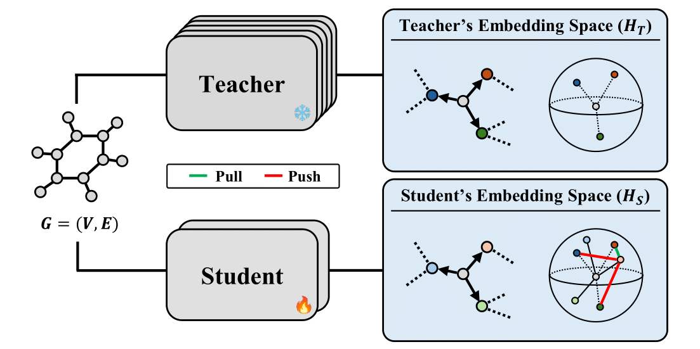

# CRACK: Contrastive Relational-Aware Compression of Knowledge

This repository is the official implementation of the paper **CRACK: Contrastive Relational-Aware Compression of Knowledge for Machine Learning Force Fields**.

CRACK is a novel knowledge distillation (KD) framework that directly distills interatomic relational knowledge from a large, accurate *teacher* Machine Learning Force Field (MLFF) into a smaller, more efficient *student* model. It achieves this by modeling each interatomic interaction as a *relational vector* derived from the embeddings of bonded atoms. Using a contrastive learning objective, CRACK trains the student to generate relational vectors that are uniquely identifiable with their teacher counterparts, effectively teaching the student the geometry of the teacher's learned Potential Energy Surface (PES).

On the challenging OC20 benchmark, CRACK enables a compact 22M-parameter student EquiformerV2 to achieve superior energy and force prediction accuracy, significantly outperforming strong distillation baselines.

<p align="center">
  
</p>

This repository extends the original [EquiformerV2](https://github.com/atomicarchitects/equiformer) repository.

## Environment Setup

### Environment 

We use conda to install required packages:
```
    conda env create -f env/env.yml
```

We activate the environment:
```
    conda activate equiformer_v2
```

Finally, we install `fairchem` by running:
```
    cd fairchem
    pip install -e .
```


### OC20

The OC20 S2EF dataset can be downloaded by following instructions in their [GitHub repository](https://github.com/Open-Catalyst-Project/ocp/blob/5a7738f9aa80b1a9a7e0ca15e33938b4d2557edd/DATASET.md#download-and-preprocess-the-dataset).

For example, we can download the OC20 S2EF-2M dataset of O absorbates by running:
```
    cd fairchem
    python scripts/download_data_Oabs.py --task is2re --split "Oabs" --num-workers 8 --ref-energy
```

After downloading, place the datasets under `datasets/oc20/` by using `ln -s`:
```
    cd datasets
    mkdir oc20
    cd oc20
    ln -s ../../fairchem/data/Oabs Oabs
```


## Training and Inference


### Distillation with CRACK

To train a student model using CRACK knowledge distillation, you can run the following script. This will start the training process using the configuration file, which specifies the teacher model, student architecture, and distillation hyperparameters.

```bash
sh scripts/train/oc20/s2ef/equiformer_v2/22M_crack.sh
```

### OC20 Inference

To run inference with the original EquiformerV2 models on the OC20 **is2re** dataset, you can use the following scripts:
    
```bash
sh scripts/train/oc20/s2ef/equiformer_v2/31M_exp.sh
sh scripts/train/oc20/s2ef/equiformer_v2/153M_exp.sh
```

## Checkpoints

We provide checkpoints for the original EquiformerV2 models as well as our CRACK-distilled student model.

### CRACK Student Model
This is the 22M-parameter student model trained with CRACK, using the 153M EquiformerV2 as the teacher.

|Model	|Params	|Dataset|Download	|val force MAE (meV / Å) |val energy MAE (meV) |
|---	|---	|---	|---	|---	|---	|
|EquiformerV2 (Student) |22M |O* |[checkpoint](https://github.com/hyukjunlim/CRACK/releases/download/v1.0/crack_student_22m.pt) \| [config](oc20/configs/s2ef/all_md/equiformer_v2/equiformer_v2_N@20_L@6_M@3_22M_crack.yml) |5.8 | 231.7 |

### Original EquiformerV2 Models
These are the EquiformerV2 models trained on S2EF-2M or S2EF-All+MD datasets without distillation.

|Model	|Params |Split	|Download	|val force MAE (meV / Å) |val energy MAE (meV) |
|---	|---	|---	|---	|---	|---	| 
|EquiformerV2	|83M |2M	|[checkpoint](https://dl.fbaipublicfiles.com/opencatalystproject/models/2023_06/oc20/s2ef/eq2_83M_2M.pt) \| [config](oc20/configs/s2ef/2M/equiformer_v2/equiformer_v2_N@12_L@6_M@2_epochs@30.yml)	|19.4 | 278 |
|EquiformerV2 |31M |All+MD |[checkpoint](https://dl.fbaipublicfiles.com/opencatalystproject/models/2023_06/oc20/s2ef/eq2_31M_ec4_allmd.pt) \| [config](oc20/configs/s2ef/all_md/equiformer_v2/equiformer_v2_N@8_L@4_M@2_31M.yml) |16.3 | 232 |
|EquiformerV2 (Teacher)|153M |All+MD | [checkpoint](https://dl.fbaipublicfiles.com/opencatalystproject/models/2023_06/oc20/s2ef/eq2_153M_ec4_allmd.pt) \| [config](oc20/configs/s2ef/all_md/equiformer_v2/equiformer_v2_N@20_L@6_M@3_153M.yml) |15.0 | 227 |

